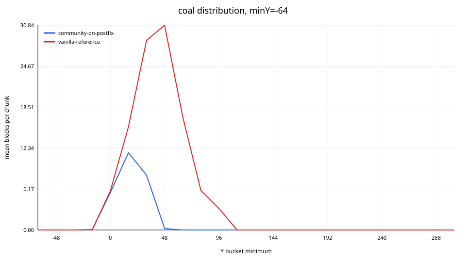
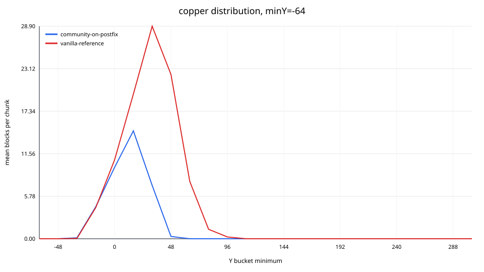
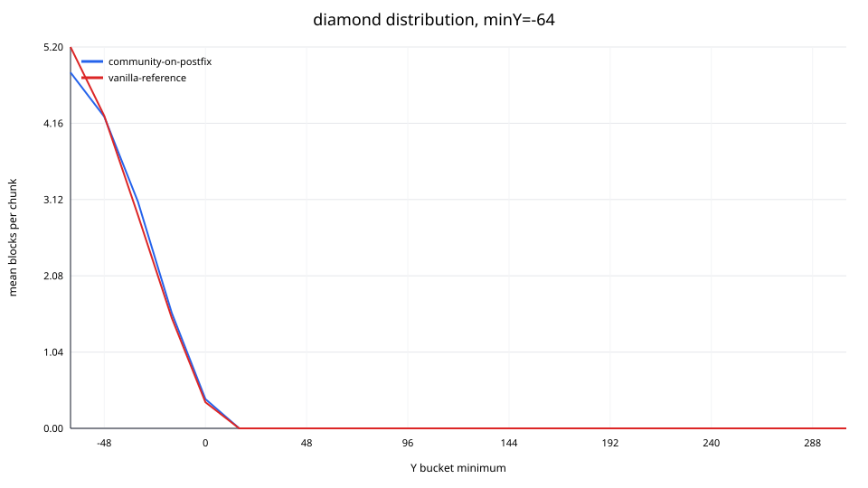
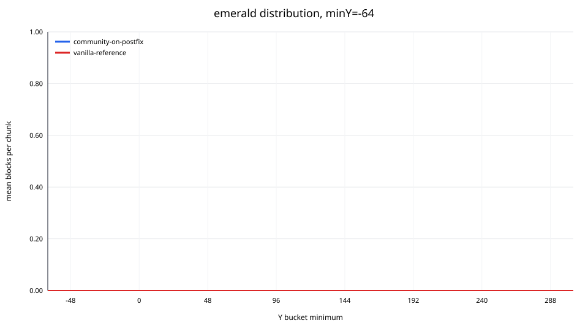
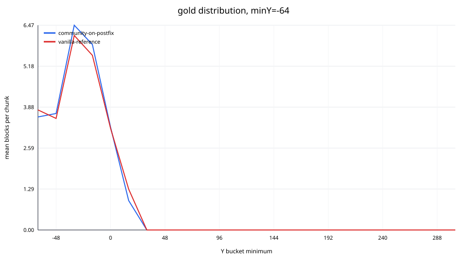
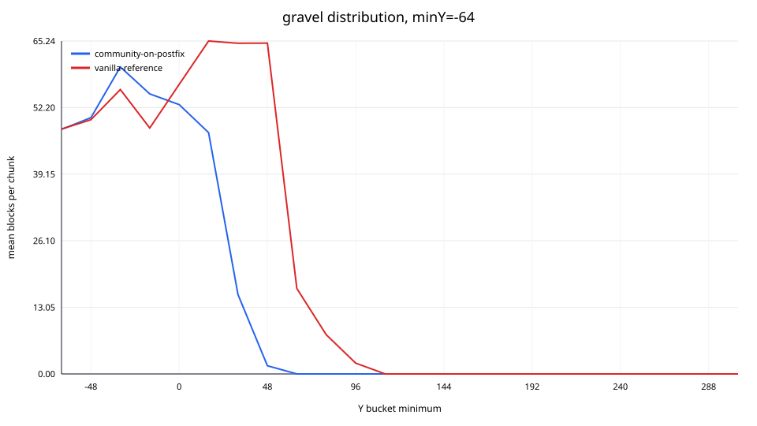
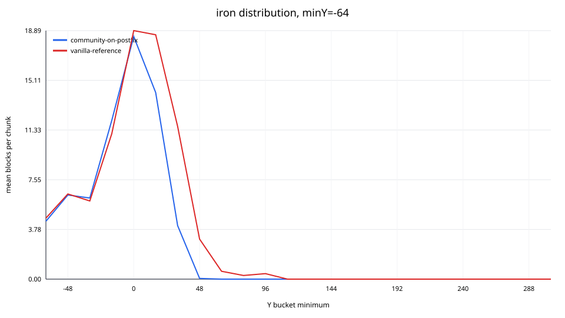
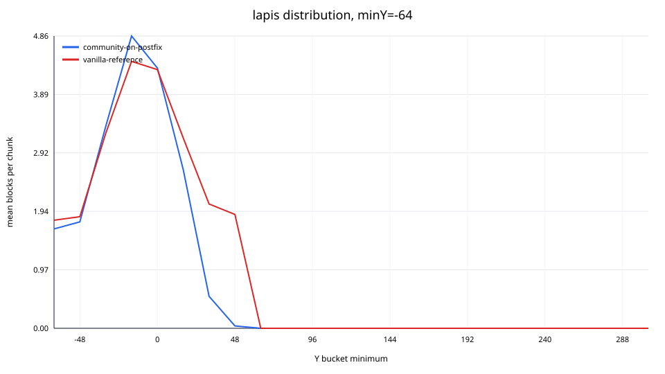
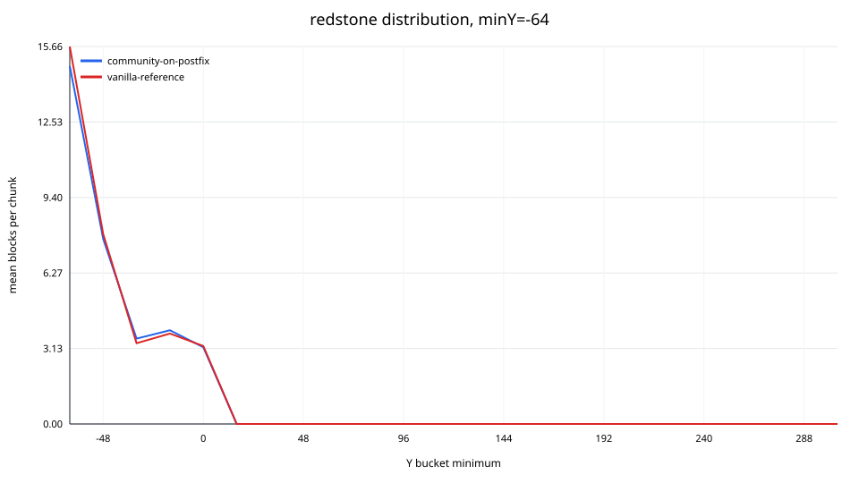
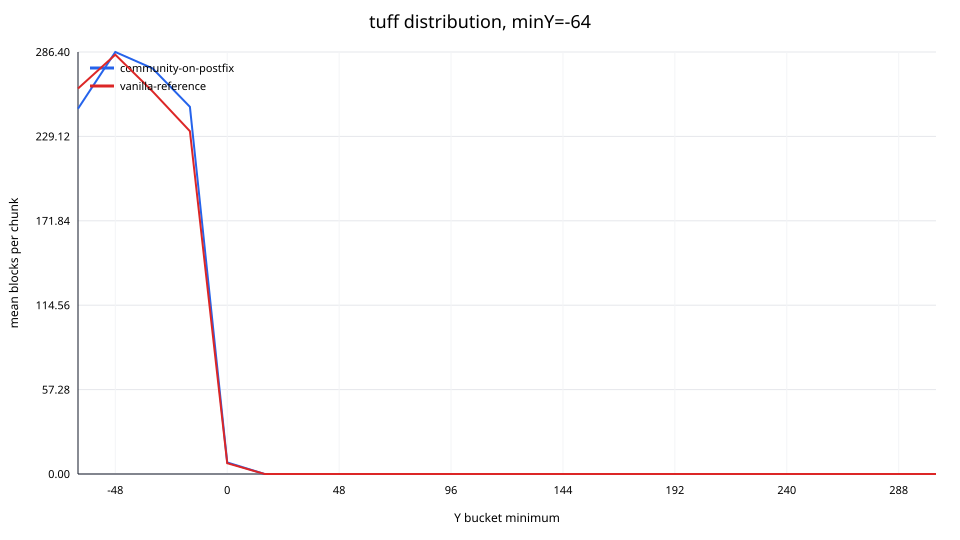

# Ore distribution charts

## coal, minY=-64

## copper, minY=-64

## diamond, minY=-64

## emerald, minY=-64

## gold, minY=-64

## gravel, minY=-64

## iron, minY=-64

## lapis, minY=-64

## redstone, minY=-64

## tuff, minY=-64

